# Cards

Cards have base health points (**HP**) and attack (**ATK**).
They are split into five categories: four families and other cards.

Cards can have effects triggered as follows:

- **TURN**: At the beginning of each turn, from next turn
- **PLAYED**: When this card is played
- **DEATH**: When this card dies
- **SURVIVED**: When this card attacks and survives
- **HIT**: When this card attacks or is attacked
- **KILL**: When this card kills an enemy
- **SOLD**: When this card is sold
- (**PASSIVE**: Always apply)

## Mushrooms

Image | Rank | Name | ATK | HP | Effects
------|------|------|-----|----|--------
 | 1 | Coprinus | 1 | 3 | —
 | 1 | Gomphidius | 1 | 1 | (Slimy) **TURN**: This card gets +1 HP
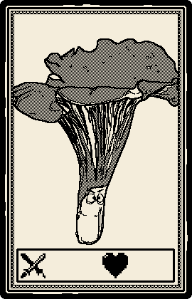 | 2 | Cantharellus | 2 | 5 | —
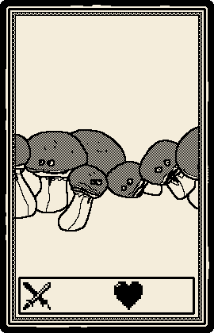 | 2 | Mycelius | 1 | 1 | (Sweet scent) **PLAYED**: Gives +1 HP +1 ATK to other Mush cards
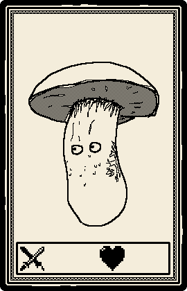 | 3 | Amanita | 0 | 2 | (Toxic spores) **DEATH**: Toxic spores are released and kill the opponent
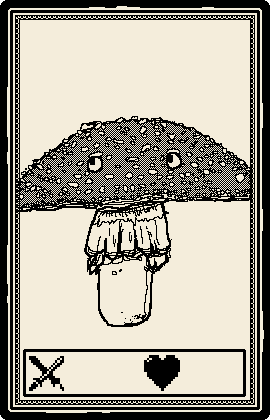 | 3 | Boletus | 4 | 2 | (Sporocarp) **SOLD**: add a random Mush to your hand
 | 4 | Silex fungi | 6 | 2 | (Roots) **TURN**: Gets +1 HP for each allied Mush
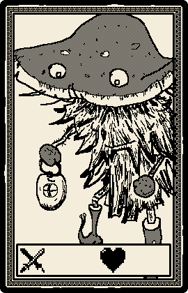 | 4 | Titanicus | 5 | 6 | (Gigantism) **KILL**: Gets +1 ATK

## Merchants

Image | Rank | Name | ATK | HP | Effects
------|------|------|-----|----|--------
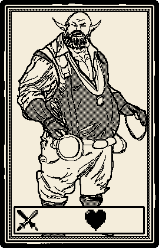 | 1 | Silvanus | 1 | 3 | —
 | 1 | Estan | 1 | 4 | (Sadism) **SURVIVED**: Attack a random ally once (50%)
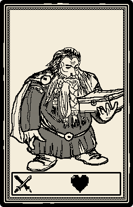 | 2 | Mandra | 1 | 1 | (Exploding armour) **DEATH**: Deals 1 DMG to every enemy card
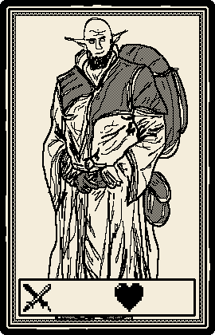 | 2 | Julius | 2 | 5 |  —
 | 3 | Sixante | 5 | 3 | (Pillage) **KILL**: Gain +1 gold for the next turn
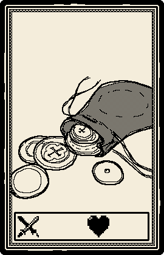 | 3 | Eladra | 1 | 7 | (Gold mine) **TURN**: Gain +1 gold for this turn
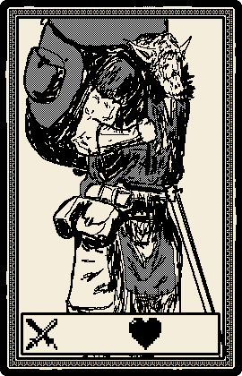 | 4 | Jasmar | 4 | 8 | (Altruism) **SOLD**: Distribute its max HP between allies
 | 4 | Tujilus | 5 | 9 | (Dexterity) **SURVIVED**: Attacks another enemy once

## Spiders

Image | Rank | Name | ATK | HP | Effects
------|------|------|-----|----|--------
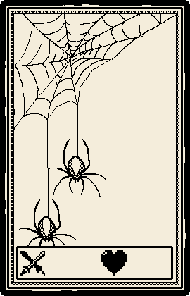 | 1 | Micro spider | 2 | 1 | (Cooperation) **PLAYED**: Gets +1 HP for each spider on board
 | 1 | Jumping Spider | 2 | 2 | —
 | 2 | Funnel Web Spider | 3 | 2 | (Trap) **HIT**: Lowers the opponents attacks by half
 | 2 | Goliath | 3 | 3 | —
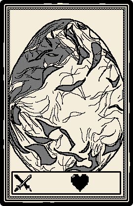 | 3 | Egg | 0 | 1 | (Multiplication) **DEATH**: Fills the board with lower rank spiders
 | 3 | Tarantula | 5 | 2 | (Poisonous) **HIT**: Bites the opponent and kills it
 | 4 | Aragog | 4 | 6 | (Spawn) **TURN**: Spawns a new Rank 1 Spider
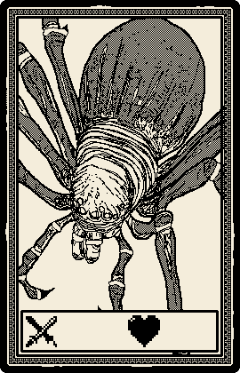 | 4 | Australian black widow | 4 | 4 | (Cannibalism) **TURN**: Eats the lowest rank spider of the board, and gains its stats

## Robots

Image | Rank | Name | ATK | HP | Effects
------|------|------|-----|----|--------
 | 1 | Nanobot | 1 | 1 | (Replication) **PLAYED**: Spawns a new Nanobot
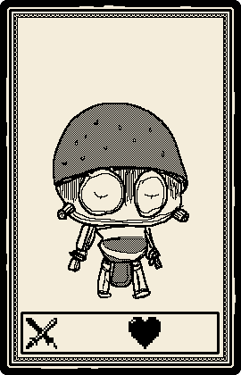 | 1 | Cleaning robot | 1 | 3 | –
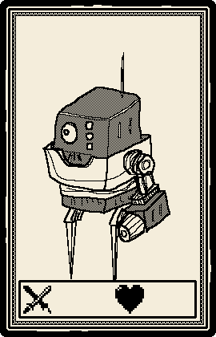 | 2 | Turret | 3 | 1 | (Scanner) **PLAYED**: Gains +1 HP and +1 ATK for each allied Nanobot
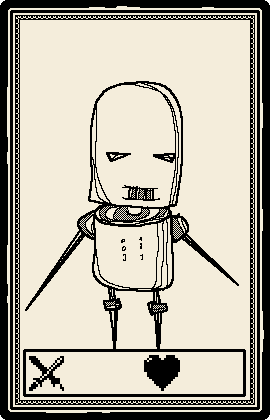 | 2 | Modular bot | 2 | 2 | (Upgrade) **TURN**: Gives +1 HP and +1 ATK to itself and adjacent cards
 | 3 | Unfinished prototype | 4 | 2 | (Glitch) **HIT**: Removes 2 HP max or 2 ATK max to the enemy
 | 3 | Humanoid | 4 | 8 | –
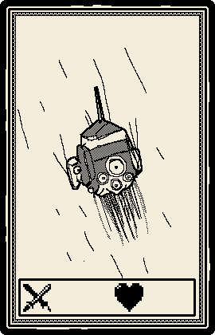 | 4 | Repair drones | 5 | 12 | (Upload) **TURN**: This loses 2 HP and gives +2 HP to allied robots
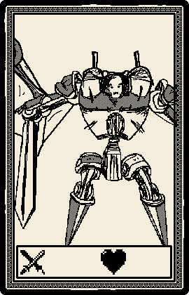 | 4 | SkyBot | 3 | 3 | (Download) **TURN**: Steals +1 HP and +1 ATK from each allied robot