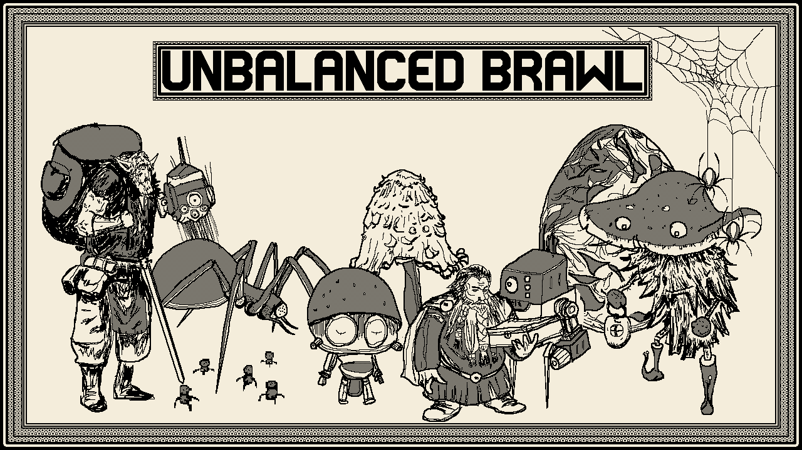

 

# Unbalanced Brawl

    

Unbalanced Brawl is an autochess made for LD49. See the [entry page](https://ldjam.com/events/ludum-dare/49/unbalanced-brawl) for gameplay details.

Play on [itch.io](https://yopox.itch.io/unbalanced-brawl).

# Setup

- Put `ChevyRay - Bird Seed.ttf`, `ChevyRay - Skullboy.ttf` & `ChevyRay - Love Bug.ttf` in `assets/` (find the fonts [here](https://chevyray.itch.io/pixel-fonts))
- Run desktop version with `cargo make run`
- Build web version with `cargo make --profile release build-web`

# Implemented

Check the [list of cards](https://github.com/yopox/LD49/blob/main/cards.md).

## Abilities

The following abilities are implemented:

### Mushrooms

- [x] Slimy TURN
- [x] Sweet scent PLAYED
- [x] Toxic spores DEATH
- [x] Sporocarp SOLD
- [x] Roots TURN
- [x] Gigantism KILL

### Merchants

- [ ] Sadism SURVIVED
- [x] Exploding armour DEATH
- [x] Pillage KILL
- [x] Gold mine TURN
- [x] Altruism SOLD
- [x] Dexterity SURVIVED

### Spiders

- [x] Cooperation PLAYED
- [x] Trap HIT
- [ ] Multiplication DEATH
- [x] Poisonous HIT
- [x] Spawn TURN 
- [x] Cannibalism TURN

### Robots

- [x] Replication PLAYED
- [x] Scanner PLAYED
- [x] Upgrade TURN
- [ ] Glitch HIT
- [x] Upload TURN
- [x] Download TURN
